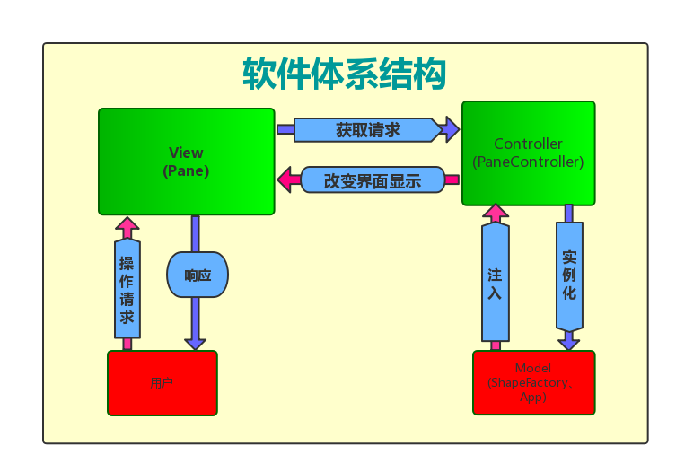
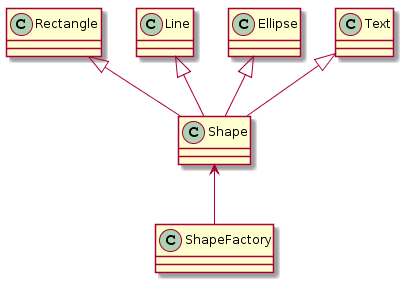
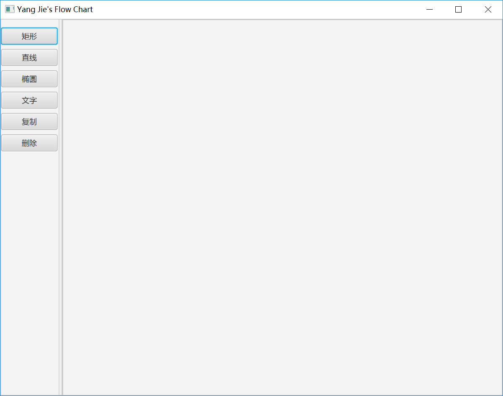
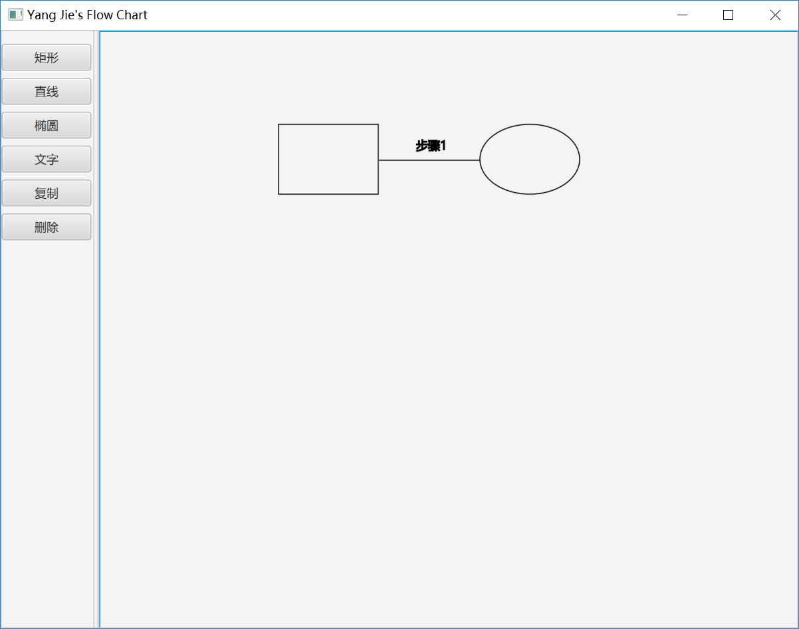
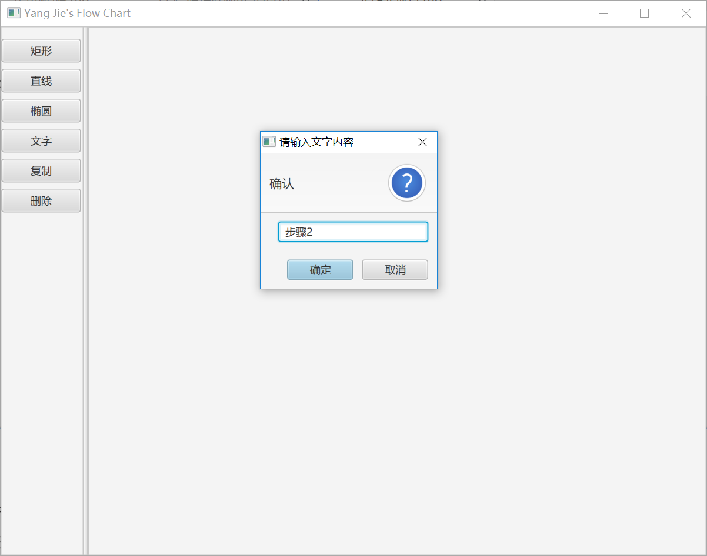

# FlowChart

## 1. 引言
本次作业的目是实现一个简易流程图绘制软件，由于既需要实现GUI界面，又要在面向对象的基础上维持良好的代码风格，因此选择了JavaFX作为开发框架。
JavaFX是Sun公司2007年发布的，是准备替代Applet的一种技术或者平台，其包括JavaFX脚本语言和JavaFX Mobile应用，JavaFX脚本语法类似于SVG，用于快速开发图形用户界面。JavaFX以其独特的优势，正在RIA开发领域逐步崭露头角，依靠着众多第三方库的支持，它在面临着任何快速开发时，都能找到合适的支撑。
## 2. 分析设计
### 2.1 UML建模
  

系统采用了MVC架构，`View`层显示界面并接收用户处理请求，`Controller`层从`View`层获取请求，并根据事件类型对`Model`层进行相应操作。
`Model`层主要实体定义如下：  
  

`Rectangle`、`Line`、`Ellipse`、`Text`均继承自`Shape`类，`ShapeFactory`类为Shape工厂，根据传入的参数选择实例化不同的Shape子类。
### 2.2 设计模式
1. 工厂模式
`ShapeFactory`类为`Shape`类的简单工厂，根据传入参数的不同，选择实例化不同的Shape子类。
2. 单例模式
`App`类为单例，系统维持全局有且仅有一个`App`类的实例。
3. 观察者模式
代码中运用了JavaFX框架中的事件监听模型，设置了相应的Listener。
4. 备忘录模式
软件的图形复制功能用到了备忘录模式，捕获所要复制的实体的内部状态。
## 三、实现方案
主要的类和方法如下
- `ShapeFactory` 

|方法|简介|  
|---|---|  
|`getRectangle(double x, double y, double w, double h)`|实例化一个矩形|
|`getLine(double x1, double y1, double x2, double y2)`|实例化一条直线|
|`getEllipse(double centerX,double centerY,double radiusX,double radiusY)`|实例化一个椭圆|
|`getText(double x, double y, String textContent)`|实例化文字|
- `PaneController`

|方法|简介|
|---|---|
|`initialize()`|根据用户选择的不同操作，调用`ShapeFactory`中的相应方法初始化出相应的图形或者执行相应的复制、撤销操作|
- `App`

|方法|简介|
|---|---|
|`getInstance()`|获取App类的单例|
|`setSelectedShape(Shape shape)`|将新建的图形对象加入队列|
|`getSelectedShape()`|获取当前选中的图形对象|
## 四、功能介绍
软件界面效果如下：

实现的功能有：
- 绘制矩形、椭圆和直线：点击相应的按钮，可以绘制出相应的图形，拖动图形可以实现自由移动；
- 添加文字描述：点击“文字”按钮，在弹出的输入框中输入文字内容，可以添加相应的文字，拖动文字可以实现自由移动；
- 复制图形和文字：选中想要复制的图形或文字，点击“复制”按钮，可以实现选中内容的复制；
- 撤销选中内容：选中想要删除的图形或文字，点击“删除”按钮，可以实现选中内容的撤销。
## 五、实验总结
本次实验由于选择了合适的框架与设计模式，开发起来比较方便，各模块之间耦合度也较低，代码可复用、可拓展程度很高，但是由于考试周任务繁重，加上本人能力有限，附加功能并没有来得及完成，仍然需要并可以继续完善。